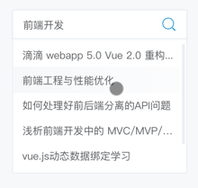

## jekyll-theme-H2O

基于Jekyll的博客主题模板，简洁轻量。

### Features 特性

#### CN

- 代码高亮
- 夜间模式
- Disqus评论系统
- 粉蓝两种主题色
- 头图个性化底纹
- 响应式设计
- 社交图标
- SEO标题优化
- 文章标签索引
- 博客文章搜索
- 复制文章内容自动添加版权

#### EN

- Code highlight
- Night mode
- Disqus Comment System
- Theme color: Blue & Pink
- Hero Patterns
- Responsive design
- SNS Icon
- Title SEO
- Tags system
- Search
- Copyright text on copy event


#### 社交图标

使用阿里的图标管理平台Iconfont整理了一套常用的社交图标用于博客的个人简介上，包括微博、知乎、掘金、简书、Github等十三个网站，并且对鼠标悬停时的样式颜色进行了优化。

配置格式如下：

```
# SNS settings 配置社交网站url
sns:
  weibo: '//weibo.com/lovecolcol'
  juejin: '//juejin.im/user/57a6f434165abd006159b4cc'
  instagram: '//www.instagram.com/steveliaocn'
  github: '//github.com/kaeyleo'
```

sns属性可选参数：

社交网站 | 参数
--------|----
微博 | `weibo`
知乎 | `zhihu`
推特 | `twitter`
Instagrame | `instagrame`
掘金 | `juejin`
Github | `github`
豆瓣 | `douban`
Facebook | `facebook`
Dribble | `dribble`
UI中国 | `uicn`
简书 | `jianshu`
Medium | `medium`
领英 | `linkedin`


#### 文章搜索



基于Jekyll服务器生成文章索引文件 `search.json` 为博客提供搜索服务。输入文章标题或与文章标签相关的关键字即可。

搜索功能默认是开启的，以卡片的样式显示在侧边栏底部。如需关闭请将配置文件 `_config.yml` 中 `search ` 属性的值改为 `false` 。 


#### 自定义

主题开发使用的技术栈也比较简单：引入jQuery类库、使用Sass代替CSS编写样式，使用Gulp完成Sass的编译、CSS和JavaScript的代码合并压缩等任务。

如果你喜欢折腾，想对模板的代码进行修改，需要使用命令 `npm install` 安装 `package.json` 中的依赖，然后 `gulp` 一下即可开始你的自定义之旅。

在了解H2O主题的目录结构之前，确保你对[Jekyll目录结构](http://jekyll.com.cn/docs/structure/)有所了解。

```		
	.
	├── _config.yml # 配置文件
	├── _includes # 页面组件方便重用
	|   ├── footer.html # 页脚
	|   └── head.html # html文档的头部内容
	|   └── header.html # 顶部菜单栏
	|   └── pageNav.html # 文章列表分页组件
	├── _layouts # 布局模板
	|   ├── default.html # 默认模板
	|   └── post.html # 文章页面模板
	├── _posts # 这里放文章
	|   ├── 2017-05-03-elements-of-javascript-style.md # 命名格式：年-月-日-文章标题.md
	|   └── 2007-02-21-life-on-mars.md
	├── _site # Jekyll将源码处理后生成的站点文件，里面的内容可直接发布
	├── assets # 存放用于线上环境的静态资源，如需修改css和js文件请到dev文件夹
	|   ├── css # dev文件夹中sass编译后的样式文件
	|   └── fonts # 字体文件
	|   └── icons # 图标文件
	|   └── img #  图片文件
	|   └── js # dev文件夹中处理后的脚本文件
	├── dev # 开发文件
	|   ├── js # 存放脚本源码
	|   └── sass # 样式源码
	|       └── app.scss # 整合下面的所有样式文件
	|       └── base.scss # 引入字体、Reset部分样式
	|       └── common.scss # 模板的主要样式
	|       └── helper.scss # 工具样式
	|       └── layouts.scss # 响应式布局
	└── gulpfile.js # 自动化任务脚本
	└── index.html # 模板首页
	└── tags.html # 标签页面
	└── 404.html # 404页面
	└── package.json # 管理项目的依赖项
```

值得注意的是，css及js的源码都在 `dev` 文件夹中，每一次保存 gulp 都会对它们进行处理并保存到 `assets` 文件夹以供 `_site` 上线环境使用。

#### Disqus

[Disqus](https://disqus.com/)是一个第三方社交评论插件，体验相当不错。

模板默认开启Disqus评论插件，如需关闭请在 `_config.yml` 中配置参数 `true` (开启) 或者 `false` (关闭) :  

在配置文件 `_config.yml` 中找到Disqus的相关配置，设置 `disqus` 参数为 `true` 打开评论功能，并且设置 `disqus_url`。

```
# Comments
disqus: true
disqus_url: 'https://你的disqus账户名.disqus.com/embed.js'
```

注：`disqus` 默认值为 `false`

#### Share.js

为了让文章更方便地分享，使用了第三方分享插件[Share.js](http://overtrue.me/share.js/)，支持一键分享到微博、QQ空间、QQ好友、微信、腾讯微博、豆瓣、Facebook、Twitter、Linkedin、Google+、点点等社交网站。


### License 许可证

Jekyll-Theme-H2O is licensed under [MIT](https://github.com/kaeyleo/jekyll-theme-H2O/blob/master/LICENSE).
